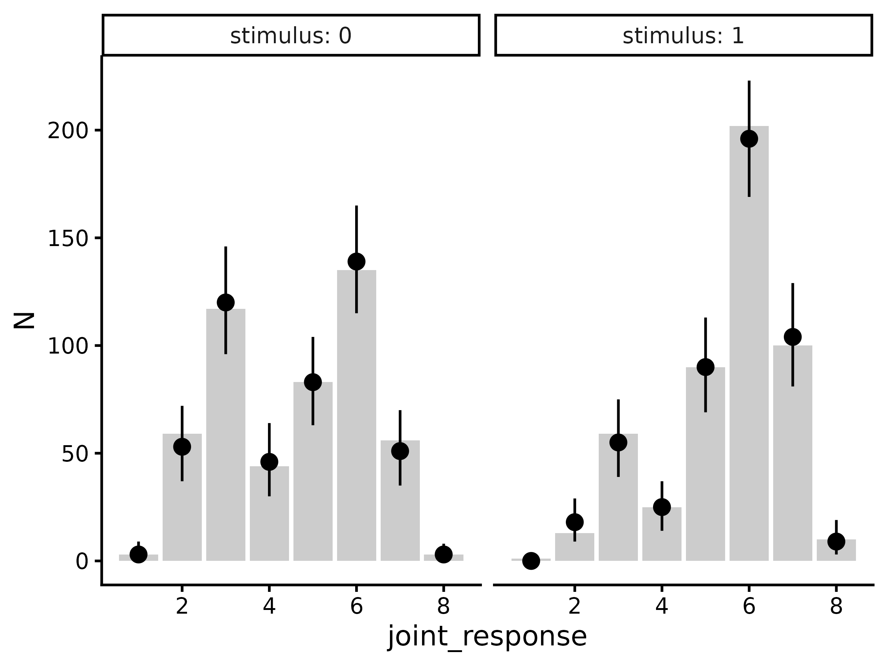
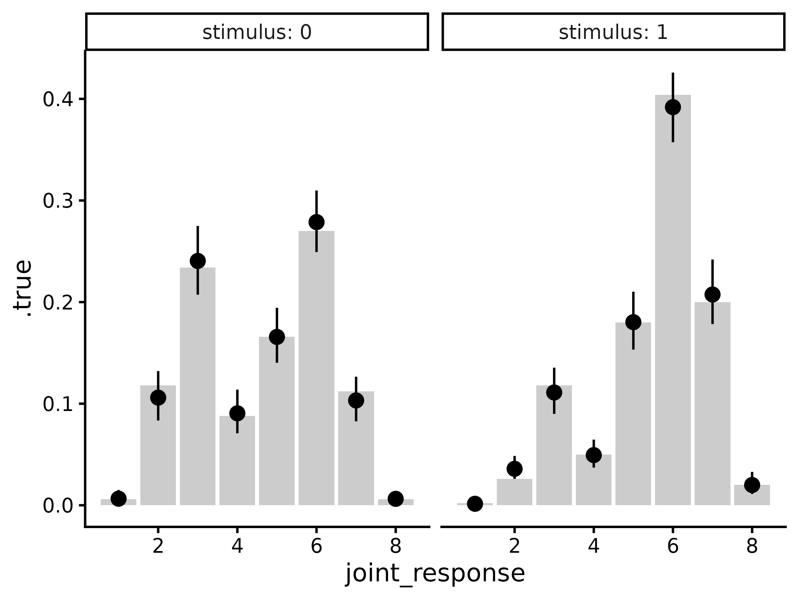
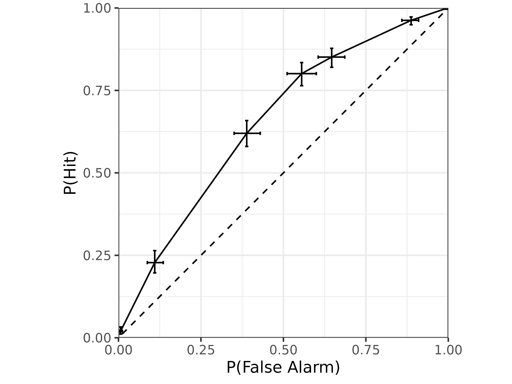
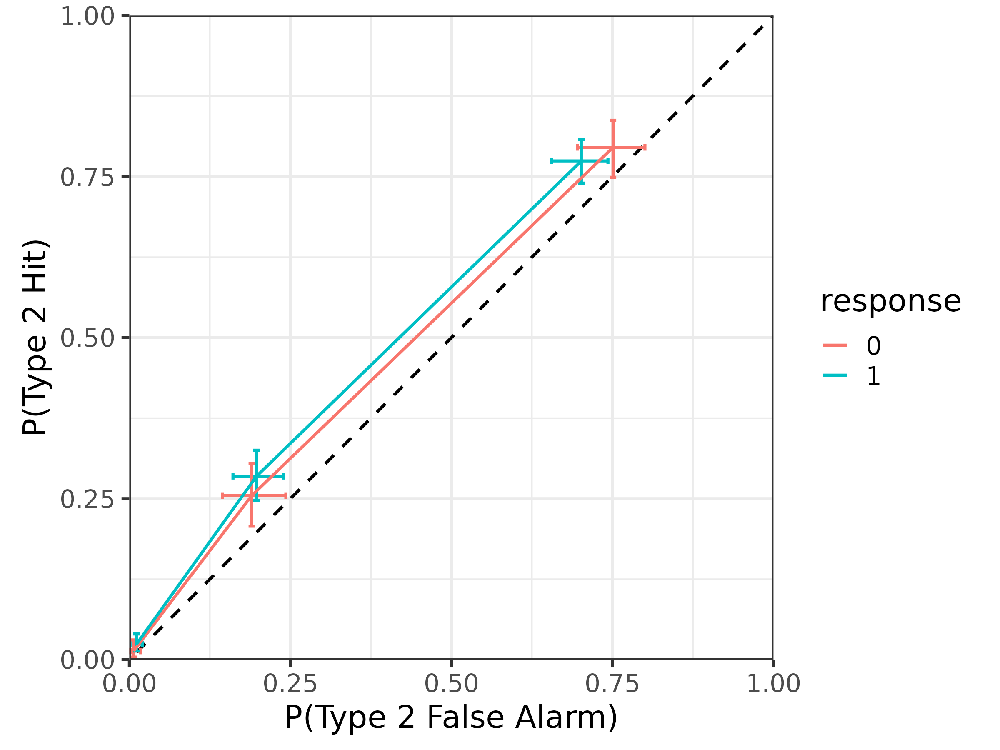

# Fitting the meta-d' model

## Introduction

This vignette demonstrates how to use the `hmetad` package to fit the
meta-d’ model ([Maniscalco and Lau 2012](#ref-maniscalco2012)) to a
canonical metacognition experiment which requires a binary decision
together with a confidence rating on each trial.

## Data preparation

To get a better idea of what kind of datasets the `hmetad` package is
designed for, we can start by simulating one (see
[`help('sim_metad')`](https://metacoglab.github.io/hmetad/reference/sim_metad.md)
for a description of the data simulation function):

``` r
library(tidyverse)
library(tidybayes)
library(hmetad)

d <- sim_metad(
  N_trials = 1000, dprime = .75, c = -.5, log_M = -1,
  c2_0 = c(.25, .75, 1), c2_1 = c(.5, 1, 1.25)
)
```

    #> # A tibble: 1,000 × 4
    #> # Groups:   stimulus, response, confidence [16]
    #>    trial stimulus response confidence
    #>    <int>    <int>    <int>      <int>
    #>  1     1        0        0          1
    #>  2     2        0        0          1
    #>  3     3        0        0          1
    #>  4     4        0        0          1
    #>  5     5        0        0          1
    #>  6     6        0        0          1
    #>  7     7        0        0          1
    #>  8     8        0        0          1
    #>  9     9        0        0          1
    #> 10    10        0        0          1
    #> # ℹ 990 more rows

As you can see, our dataset has a column for the `trial` number, the
presented `stimulus` on each trial (`0` or `1`), the participant’s type
1 response (`0` or `1`), and the corresponding type 2 response
(confidence; `1:K`). The trials in this dataset are sorted by
`stimulus`, `response`, and `confidence` because this data set is
simulated, but otherwise this should look very similar to the kind of
data that you would get from running your own experiment.

### Type 1, type 2, and joint responses

One wrinkle is that some paradigms do not collect a separate decision
(i.e., type 1 response) and confidence rating (i.e., type 2
response)—rather, they collect a single rating reflecting both the
primary decision and confidence. For example, instead of a binary type 1
response and a type 2 response ranging from `1` to `K` (where `K` is the
maximum confidence level), sometimes participants are asked to make a
rating on a scale from `1` to `2*K`, where `1` represents a confidence
`"0"` response, `K` represents an uncertain `"0"` response, `K+1`
represents an uncertain `"1"` response, and `2*K` represents a confident
`"1"` response. We will refer to this as a *joint response*, as it is a
combination of the type 1 response and the type 2 response.

If you would like to convert joint response data into separate type 1
and type 2 responses, you can use the corresponding functions
`type1_response` and `type2_response`. For example, if instead we had a
dataset that looked like this:

    #> # A tibble: 1,000 × 2
    #>    trial joint_response
    #>    <int>          <int>
    #>  1     1              4
    #>  2     2              4
    #>  3     3              4
    #>  4     4              4
    #>  5     5              4
    #>  6     6              4
    #>  7     7              4
    #>  8     8              4
    #>  9     9              4
    #> 10    10              4
    #> # ℹ 990 more rows

Then we could convert our joint response like so:

``` r
d.joint_response |>
  mutate(
    response = type1_response(joint_response, K = 4),
    confidence = type2_response(joint_response, K = 4)
  )
#> # A tibble: 1,000 × 4
#>    trial joint_response response confidence
#>    <int>          <int>    <int>      <dbl>
#>  1     1              4        0          1
#>  2     2              4        0          1
#>  3     3              4        0          1
#>  4     4              4        0          1
#>  5     5              4        0          1
#>  6     6              4        0          1
#>  7     7              4        0          1
#>  8     8              4        0          1
#>  9     9              4        0          1
#> 10    10              4        0          1
#> # ℹ 990 more rows
```

Similarly, you can also convert the separate responses into a joint
response:

``` r
d |>
  mutate(joint_response = joint_response(response, confidence, K = 4))
#> # A tibble: 1,000 × 5
#> # Groups:   stimulus, response, confidence [16]
#>    trial stimulus response confidence joint_response
#>    <int>    <int>    <int>      <int>          <int>
#>  1     1        0        0          1              4
#>  2     2        0        0          1              4
#>  3     3        0        0          1              4
#>  4     4        0        0          1              4
#>  5     5        0        0          1              4
#>  6     6        0        0          1              4
#>  7     7        0        0          1              4
#>  8     8        0        0          1              4
#>  9     9        0        0          1              4
#> 10    10        0        0          1              4
#> # ℹ 990 more rows
```

Note that in both cases we need to specify that our confidence scale has
`K=4` levels (meaning that our joint type 1/type 2 scale has `8`
levels).

### Signed and unsigned binary numbers

Often datasets will use `-1` and `1` instead of `0` and `1` to represent
the two possible stimuli and type 1 responses. While the `hmetad`
package is designed to use the *unsigned* (`0` or `1`) version, it
provides helper functions to convert between the two:

``` r
to_unsigned(c(-1, 1))
#> [1] 0 1
```

``` r
to_signed(c(0, 1))
#> [1] -1  1
```

### Data aggregation

Finally, to ensure that the model runs efficiently, the `hmetad` package
currently requires data to be aggregated. If it is easier, the `hmetad`
package will aggregate your data for you when you fit your model. But if
you would like to do so manually (e.g., for plotting or follow-up
analyses), the `aggregate_metad` function can do this for you:

``` r
d.summary <- aggregate_metad(d)
#> `hmetad` has inferred that there are K=4 confidence levels in the data. If this is incorrect, please set this manually using the argument `K=<K>`
```

    #> # A tibble: 1 × 3
    #>     N_0   N_1 N[,"N_0_1"] [,"N_0_2"] [,"N_0_3"] [,"N_0_4"] [,"N_0_5"] [,"N_0_6"]
    #>   <int> <int>       <int>      <int>      <int>      <int>      <int>      <int>
    #> 1   500   500           3         59        117         44         83        135
    #> # ℹ 1 more variable: N[7:16] <int>

The resulting data frame has three columns: `N_0` is the number of
trials with `stimulus==0`, `N_1` is the number of trials with
`stimulus==1`, and `N` is a matrix containing the number of joint
responses for each of the two possible stimuli (with column names
indicating the `stimulus` and `joint_response`).

If you would like to use variable name other than `N` for the counts,
you can change the name with the `.name` argument:

``` r
aggregate_metad(d, .name = "y")
#> `hmetad` has inferred that there are K=4 confidence levels in the data. If this is incorrect, please set this manually using the argument `K=<K>`
#> # A tibble: 1 × 3
#>     y_0   y_1 y[,"y_0_1"] [,"y_0_2"] [,"y_0_3"] [,"y_0_4"] [,"y_0_5"] [,"y_0_6"]
#>   <int> <int>       <int>      <int>      <int>      <int>      <int>      <int>
#> 1   500   500           3         59        117         44         83        135
#> # ℹ 1 more variable: y[7:16] <int>
```

If you have other columns in your dataset (e.g., `participant` or
`condition` columns) that you would like to be aggregated separately,
you can simply add them to the function call:

``` r
aggregate_metad(d, participant, condition)
```

Finally, note that `aggregate_metad` automatically estimates the number
of confidence levels based on the maximum value of the confidence or
joint response column in your data. This usually works fine, but may
fail in cases with missing data (e.g., no participant gives a confidence
rating of `3` on a `4`-point scale). The number of confidence levels can
be specified manually using the argument `K`:

``` r
aggregate_metad(d, participant, condition, K = 4)
```

## Model fitting

To fit the model, we can use the `fit_metad` function. This function is
simply a wrapper around
[`brms::brm`](https://paulbuerkner.com/brms/reference/brm.html), so
users are **strongly** encouraged to become familiar with [the `brms`
package](https://paulbuerkner.com/brms/) before model fitting. In
particular, users are likely to run into convergence errors using the
default (flat) priors for model parameters, so we recommend doing
careful prior predictive checks to set weakly informed priors (see
[Schad, Betancourt, and Vasishth 2021](#ref-schad2021toward) for more
information).

Since `aggregate_metad` will place our dataset has our trial counts into
a column named `N` by default, we can use `N` as our response variable
even if our data is not yet aggregated. To fit a model with fixed values
for each parameter, then, we can use the formula `N ~ 1`:

``` r
m <- fit_metad(N ~ 1,
  data = d,
  prior = prior(normal(0, 1), class = Intercept) +
    prior(normal(0, 1), class = dprime) +
    prior(normal(0, 1), class = c) +
    prior(lognormal(0, 1), class = metac2zero1diff) +
    prior(lognormal(0, 1), class = metac2zero2diff) +
    prior(lognormal(0, 1), class = metac2one1diff) +
    prior(lognormal(0, 1), class = metac2one2diff)
)
```

    #>  Family: metad__4__normal__absolute__multinomial 
    #>   Links: mu = log 
    #> Formula: N ~ 1 
    #>    Data: data.aggregated (Number of observations: 1) 
    #>   Draws: 4 chains, each with iter = 2000; warmup = 1000; thin = 1;
    #>          total post-warmup draws = 4000
    #> 
    #> Regression Coefficients:
    #>           Estimate Est.Error l-95% CI u-95% CI Rhat Bulk_ESS Tail_ESS
    #> Intercept    -0.69      0.34    -1.45    -0.13 1.00     4631     2650
    #> 
    #> Further Distributional Parameters:
    #>                 Estimate Est.Error l-95% CI u-95% CI Rhat Bulk_ESS Tail_ESS
    #> dprime              0.71      0.08     0.54     0.87 1.00     5629     3331
    #> c                  -0.49      0.04    -0.57    -0.41 1.00     3635     3018
    #> metac2zero1diff     0.21      0.02     0.17     0.26 1.00     6021     3170
    #> metac2zero2diff     0.78      0.06     0.67     0.89 1.00     4866     2703
    #> metac2zero3diff     1.28      0.18     0.98     1.65 1.00     7047     3234
    #> metac2one1diff      0.47      0.03     0.41     0.54 1.00     4783     3192
    #> metac2one2diff      1.00      0.05     0.91     1.09 1.00     4766     3126
    #> metac2one3diff      1.30      0.11     1.10     1.52 1.00     6856     2845
    #> 
    #> Draws were sampled using sampling(NUTS). For each parameter, Bulk_ESS
    #> and Tail_ESS are effective sample size measures, and Rhat is the potential
    #> scale reduction factor on split chains (at convergence, Rhat = 1).

Note that here we have arbitrarily chosen to use standard normal priors
for all parameters. To get a better idea of how to set informed priors,
please refer to
[`help('set_prior', package='brms')`](https://paulbuerkner.com/brms/reference/set_prior.html).

In this model, `Intercept` is our estimate of \textrm{log}(M) =
\textrm{log}\frac{\textrm{meta-}d'}{d'}, `dprime` is our estimate of d',
`c` is our estimate of c, `metac2zero1diff` and `metac2zero2diff` are
the distances between successive confidence thresholds for `"0"`
responses, and `metac2one1diff` and `metac2one2diff` are the distances
between successive confidence thresholds for `"1"` responses. For each
parameter, `brms` shows you the posterior means (`Estimate`), posterior
standard deviations (`Est. Error`), upper- and lower-95% posterior
quantiles (`l-95% CI` and `u-95% CI`), as well as some convergence
metrics (`Rhat`, `Bulk_ESS`, and `Tail_ESS`).

### Manual model fitting

Most users can use `fit_metad` as above to fit their models. But in some
cases, it might be preferable to call
[`brms::brm`](https://paulbuerkner.com/brms/reference/brm.html)
directly. In such cases, the `fit_metad` function is roughly analogous
to the following code:

``` r
# calculate number of confidence levels
K <- n_distinct(d$confidence)

m <- brm(bf(...),
  data = aggregate_metad(d, ...),
  family = metad(K = K, ...),
  stanvars = stanvars_metad(K = K, ...),
  ...
)
```

## Extract model estimates

Once we have our fitted model, there are many estimates that we can
extract from it. Although `brms` provides its own functions for
extracting posterior estimates, the `hmetad` package is designed to
interface well with the `tidybayes` package to make it easier to work
with model posterior samples.

### Parameter estimates

First, it is often useful to extract the posterior draws of the model
parameters, which we can do with `linpred_draws_metad` (which is a
wrapper around
[`tidybayes::linpred_draws`](https://mjskay.github.io/tidybayes/reference/add_predicted_draws.html)):

``` r
draws.metad <- tibble(.row = 1) |>
  add_linpred_draws_metad(m)
```

    #> # A tibble: 4,000 × 15
    #> # Groups:   .row [1]
    #>     .row .chain .iteration .draw     M dprime      c meta_dprime meta_c
    #>    <int>  <int>      <int> <int> <dbl>  <dbl>  <dbl>       <dbl>  <dbl>
    #>  1     1     NA         NA     1 0.644  0.708 -0.507       0.456 -0.507
    #>  2     1     NA         NA     2 0.591  0.650 -0.423       0.384 -0.423
    #>  3     1     NA         NA     3 0.926  0.587 -0.474       0.544 -0.474
    #>  4     1     NA         NA     4 0.644  0.608 -0.520       0.392 -0.520
    #>  5     1     NA         NA     5 0.655  0.686 -0.537       0.449 -0.537
    #>  6     1     NA         NA     6 0.519  0.754 -0.493       0.392 -0.493
    #>  7     1     NA         NA     7 0.324  0.824 -0.460       0.267 -0.460
    #>  8     1     NA         NA     8 0.344  0.778 -0.418       0.268 -0.418
    #>  9     1     NA         NA     9 0.543  0.688 -0.446       0.373 -0.446
    #> 10     1     NA         NA    10 0.468  0.679 -0.494       0.318 -0.494
    #> # ℹ 3,990 more rows
    #> # ℹ 6 more variables: meta_c2_0_1 <dbl>, meta_c2_0_2 <dbl>, meta_c2_0_3 <dbl>,
    #> #   meta_c2_1_1 <dbl>, meta_c2_1_2 <dbl>, meta_c2_1_3 <dbl>

This `tibble` has a separate row for every posterior sample and a
separate column for every model parameter. This format is useful for
some purposes, but it will often be useful to pivot it so that we have a
separate row for each model parameter and posterior sample:

``` r
draws.metad <- tibble(.row = 1) |>
  add_linpred_draws_metad(m, pivot_longer = TRUE)
```

    #> # A tibble: 44,000 × 6
    #> # Groups:   .row, .variable [11]
    #>     .row .chain .iteration .draw .variable    .value
    #>    <int>  <int>      <int> <int> <chr>         <dbl>
    #>  1     1     NA         NA     1 M            0.644 
    #>  2     1     NA         NA     1 dprime       0.708 
    #>  3     1     NA         NA     1 c           -0.507 
    #>  4     1     NA         NA     1 meta_dprime  0.456 
    #>  5     1     NA         NA     1 meta_c      -0.507 
    #>  6     1     NA         NA     1 meta_c2_0_1 -0.702 
    #>  7     1     NA         NA     1 meta_c2_0_2 -1.52  
    #>  8     1     NA         NA     1 meta_c2_0_3 -2.93  
    #>  9     1     NA         NA     1 meta_c2_1_1 -0.0740
    #> 10     1     NA         NA     1 meta_c2_1_2  0.975 
    #> # ℹ 43,990 more rows

Now that all of the posterior samples are stored in a single column
`.value`, it is easy to get posterior summaries using
e.g. [`tidybayes::median_qi`](https://mjskay.github.io/ggdist/reference/point_interval.html):

``` r
draws.metad |>
  median_qi()
#> # A tibble: 11 × 8
#>     .row .variable    .value  .lower  .upper .width .point .interval
#>    <int> <chr>         <dbl>   <dbl>   <dbl>  <dbl> <chr>  <chr>    
#>  1     1 c           -0.492  -0.574  -0.409    0.95 median qi       
#>  2     1 dprime       0.708   0.543   0.874    0.95 median qi       
#>  3     1 M            0.516   0.234   0.878    0.95 median qi       
#>  4     1 meta_c      -0.492  -0.574  -0.409    0.95 median qi       
#>  5     1 meta_c2_0_1 -0.705  -0.793  -0.618    0.95 median qi       
#>  6     1 meta_c2_0_2 -1.49   -1.60   -1.37     0.95 median qi       
#>  7     1 meta_c2_0_3 -2.75   -3.14   -2.46     0.95 median qi       
#>  8     1 meta_c2_1_1 -0.0211 -0.0969  0.0566   0.95 median qi       
#>  9     1 meta_c2_1_2  0.978   0.884   1.07     0.95 median qi       
#> 10     1 meta_c2_1_3  2.28    2.07    2.51     0.95 median qi       
#> 11     1 meta_dprime  0.365   0.168   0.578    0.95 median qi
```

### Posterior predictions

One way to evaluate model fit is to perform a *posterior predictive
check*: to simulate data from the model’s posterior and compare our
simulated and actual data. We can do this using the function
`predicted_draws_metad` (which is a wrapper around
[`tidybayes::predicted_draws`](https://mjskay.github.io/tidybayes/reference/add_predicted_draws.html)):

``` r
draws.predicted <- predicted_draws_metad(m, d.summary)
```

    #> # A tibble: 64,000 × 12
    #> # Groups:   .row, N_0, N_1, N, stimulus, joint_response, response, confidence
    #> #   [16]
    #>     .row   N_0   N_1 N[,"N_0_1"] stimulus joint_response response confidence
    #>    <int> <int> <int>       <int>    <int>          <int>    <int>      <dbl>
    #>  1     1   500   500           3        0              1        0          4
    #>  2     1   500   500           3        0              1        0          4
    #>  3     1   500   500           3        0              1        0          4
    #>  4     1   500   500           3        0              1        0          4
    #>  5     1   500   500           3        0              1        0          4
    #>  6     1   500   500           3        0              1        0          4
    #>  7     1   500   500           3        0              1        0          4
    #>  8     1   500   500           3        0              1        0          4
    #>  9     1   500   500           3        0              1        0          4
    #> 10     1   500   500           3        0              1        0          4
    #> # ℹ 63,990 more rows
    #> # ℹ 5 more variables: N[2:16] <int>, .prediction <int>, .chain <int>,
    #> #   .iteration <int>, .draw <int>

In this data frame, we have all of the columns from our aggregated data
`d.summary` as well as `stimulus`, `joint_response`, `response`, and
`confidence` (indicating the simulated trial type), as well as
`.prediction` (indicating the number of simulated trials per trial
type). From here, we can plot the posterior predictions (points and
error-bars) against the actual data (bars):

``` r
draws.predicted |>
  group_by(.row, stimulus, joint_response, response, confidence) |>
  median_qi(.prediction) |>
  group_by(.row) |>
  mutate(N = t(d.summary$N[.row, ])) |>
  ggplot(aes(x = joint_response)) +
  geom_col(aes(y = N), fill = "grey80") +
  geom_pointrange(aes(y = .prediction, ymin = .lower, ymax = .upper)) +
  facet_wrap(~stimulus, labeller = label_both) +
  theme_classic(18)
#> Warning in `[<-.data.frame`(`*tmp*`, , y_vars, value = list(y = c(3, 59, :
#> replacement element 1 has 256 rows to replace 16 rows
```



### Posterior expectations

Usually it will be simpler to compare response probabilities rather than
raw response counts. To do this, we can use the same workflow as above
but using `epred_draws_metad` (which is a wrapper around
[`tidybayes::epred_draws`](https://mjskay.github.io/tidybayes/reference/add_predicted_draws.html)):

``` r
draws.epred <- epred_draws_metad(m, newdata = tibble(.row = 1))
```

    #> # A tibble: 64,000 × 9
    #> # Groups:   .row, stimulus, joint_response, response, confidence [16]
    #>     .row stimulus joint_response response confidence  .epred .chain .iteration
    #>    <int>    <int>          <int>    <int>      <dbl>   <dbl>  <int>      <int>
    #>  1     1        0              1        0          4 0.00382     NA         NA
    #>  2     1        0              1        0          4 0.00668     NA         NA
    #>  3     1        0              1        0          4 0.00436     NA         NA
    #>  4     1        0              1        0          4 0.00276     NA         NA
    #>  5     1        0              1        0          4 0.00282     NA         NA
    #>  6     1        0              1        0          4 0.00287     NA         NA
    #>  7     1        0              1        0          4 0.0103      NA         NA
    #>  8     1        0              1        0          4 0.00628     NA         NA
    #>  9     1        0              1        0          4 0.00450     NA         NA
    #> 10     1        0              1        0          4 0.00922     NA         NA
    #> # ℹ 63,990 more rows
    #> # ℹ 1 more variable: .draw <int>

``` r
draws.epred |>
  group_by(.row, stimulus, joint_response, response, confidence) |>
  median_qi(.epred) |>
  group_by(.row) |>
  mutate(.true = t(response_probabilities(d.summary$N[.row, ]))) |>
  ggplot(aes(x = joint_response)) +
  geom_col(aes(y = .true), fill = "grey80") +
  geom_pointrange(aes(y = .epred, ymin = .lower, ymax = .upper)) +
  scale_alpha_discrete(range = c(.25, 1)) +
  facet_wrap(~stimulus, labeller = label_both) +
  theme_classic(18)
#> Warning: Using alpha for a discrete variable is not advised.
#> Warning in `[<-.data.frame`(`*tmp*`, , y_vars, value = list(y = c(0.006, :
#> replacement element 1 has 256 rows to replace 16 rows
```



### Mean confidence

One can also compute implied values of mean confidence from the meta-d’
model using `mean_confidence_draws`:

``` r
tibble(.row = 1) |>
  add_mean_confidence_draws(m) |>
  median_qi(.epred) |>
  left_join(d |>
    group_by(stimulus, response) |>
    summarize(.true = mean(confidence)))
#> `summarise()` has regrouped the output.
#> Joining with `by = join_by(stimulus, response)`
#> ℹ Summaries were computed grouped by stimulus and response.
#> ℹ Output is grouped by stimulus.
#> ℹ Use `summarise(.groups = "drop_last")` to silence this message.
#> ℹ Use `summarise(.by = c(stimulus, response))` for per-operation grouping
#>   (`?dplyr::dplyr_by`) instead.
#> # A tibble: 4 × 10
#>    .row stimulus response .epred .lower .upper .width .point .interval .true
#>   <int>    <int>    <int>  <dbl>  <dbl>  <dbl>  <dbl> <chr>  <chr>     <dbl>
#> 1     1        0        0   2.06   1.99   2.15   0.95 median qi         2.09
#> 2     1        0        1   1.91   1.83   1.99   0.95 median qi         1.92
#> 3     1        1        0   1.95   1.86   2.04   0.95 median qi         1.90
#> 4     1        1        1   2.08   2.02   2.15   0.95 median qi         2.07
```

Here, `.epred` refers to the model-estimated mean confidence per
stimulus and response, and `.true` is the empirical mean confidence.

In addition, we can compute mean confidence marginalizing over stimuli:

``` r
tibble(.row = 1) |>
  add_mean_confidence_draws(m, by_stimulus = FALSE) |>
  median_qi(.epred) |>
  left_join(d |>
    group_by(response) |>
    summarize(.true = mean(confidence)))
#> Joining with `by = join_by(response)`
#> # A tibble: 2 × 9
#>    .row response .epred .lower .upper .width .point .interval .true
#>   <int>    <int>  <dbl>  <dbl>  <dbl>  <dbl> <chr>  <chr>     <dbl>
#> 1     1        0   2.03   1.95   2.11   0.95 median qi         2.03
#> 2     1        1   2.01   1.96   2.07   0.95 median qi         2.01
```

over responses:

``` r
tibble(.row = 1) |>
  add_mean_confidence_draws(m, by_response = FALSE) |>
  median_qi(.epred) |>
  left_join(d |>
    group_by(stimulus) |>
    summarize(.true = mean(confidence)))
#> Joining with `by = join_by(stimulus)`
#> # A tibble: 2 × 9
#>    .row stimulus .epred .lower .upper .width .point .interval .true
#>   <int>    <int>  <dbl>  <dbl>  <dbl>  <dbl> <chr>  <chr>     <dbl>
#> 1     1        0   1.98   1.93   2.03   0.95 median qi         2   
#> 2     1        1   2.06   2.01   2.11   0.95 median qi         2.04
```

or both over stimuli and responses:

``` r
tibble(.row = 1) |>
  add_mean_confidence_draws(m, by_stimulus = FALSE, by_response = FALSE) |>
  median_qi(.epred) |>
  bind_cols(d |>
    ungroup() |>
    summarize(.true = mean(confidence)))
#> # A tibble: 1 × 8
#>    .row .epred .lower .upper .width .point .interval .true
#>   <int>  <dbl>  <dbl>  <dbl>  <dbl> <chr>  <chr>     <dbl>
#> 1     1   2.02   1.97   2.06   0.95 median qi         2.02
```

### Metacognitive bias

While mean confidence is often empirically informative, it is not
recommended as a measure of metacognitive bias because it is known to be
confounded by type 1 response characteristics (i.e., d' and c) and by
metacognitive sensitivity (i.e., \textrm{meta-}d', [Sherman, Seth, and
Barrett 2018](#ref-sherman2018)). Instead, we recommend a new measure of
metacognitive bias, \textrm{meta-}\Delta, which is the distance between
the average of the confidence criteria and \textrm{meta-}c.

\textrm{meta-}\Delta can be interpreted as lying between two extremes:
when \textrm{meta-}\Delta = 0, the observer only uses the highest
confidence rating, and when \textrm{meta-}\Delta = \infty, the observer
only uses the lowest confidence rating.

To obtain estimates of \textrm{meta-}\Delta, one can use the function
`metacognitive_bias_draws`:

``` r
tibble(.row = 1) |>
  add_metacognitive_bias_draws(m) |>
  median_qi()
#> # A tibble: 2 × 8
#>    .row response metacognitive_bias .lower .upper .width .point .interval
#>   <int>    <int>              <dbl>  <dbl>  <dbl>  <dbl> <chr>  <chr>    
#> 1     1        0               1.16   1.03   1.31   0.95 median qi       
#> 2     1        1               1.57   1.47   1.67   0.95 median qi
```

### Pseudo Type 1 ROC

To obtain type 1 performance as a pseudo-type 1 ROC, we can use
`add_roc1_draws`:

``` r
draws.roc1 <- tibble(.row = 1) |>
  add_roc1_draws(m)
```

    #> # A tibble: 28,000 × 9
    #> # Groups:   .row, joint_response, response, confidence [7]
    #>     .row joint_response response confidence .chain .iteration .draw  p_fa p_hit
    #>    <int>          <int>    <int>      <dbl>  <int>      <int> <int> <dbl> <dbl>
    #>  1     1              1        0          4     NA         NA     1 0.996 0.999
    #>  2     1              1        0          4     NA         NA     2 0.993 0.998
    #>  3     1              1        0          4     NA         NA     3 0.996 0.999
    #>  4     1              1        0          4     NA         NA     4 0.997 0.999
    #>  5     1              1        0          4     NA         NA     5 0.997 1.000
    #>  6     1              1        0          4     NA         NA     6 0.997 0.999
    #>  7     1              1        0          4     NA         NA     7 0.990 0.997
    #>  8     1              1        0          4     NA         NA     8 0.994 0.998
    #>  9     1              1        0          4     NA         NA     9 0.996 0.999
    #> 10     1              1        0          4     NA         NA    10 0.991 0.998
    #> # ℹ 27,990 more rows

Again, we have a tidy tibble with columns `.chain`, `.iteration`, and
`.draw` identifying individual posterior samples, `joint_response`,
`response`, and `confidence` identifying the different points on the
ROC, and `.row` identifying different ROCs (since our data frame has
only one row, here there is only one ROC). In addition, we also have
`p_hit` and `p_fa`, which contain posterior estimates of type 1 hit rate
(i.e., the probability of a `"1"` response with `confidence >= c` given
`stimulus==1`) and type 1 false alarm rate (i.e., the probability of a
`"1"` response with `confidence >= c` given `stimulus==0`).

For visualization, we can get posterior summaries of the ROC using
[`tidybayes::median_qi`](https://mjskay.github.io/ggdist/reference/point_interval.html)
and then simply plot as a line:

``` r
draws.roc1 |>
  median_qi(p_fa, p_hit) |>
  ggplot(aes(
    x = p_fa, xmin = p_fa.lower, xmax = p_fa.upper,
    y = p_hit, ymin = p_hit.lower, ymax = p_hit.upper
  )) +
  geom_abline(slope = 1, intercept = 0, linetype = "dashed") +
  geom_errorbar(orientation = "y", width = .01) +
  geom_errorbar(orientation = "x", width = .01) +
  geom_line() +
  coord_fixed(xlim = 0:1, ylim = 0:1, expand = FALSE) +
  xlab("P(False Alarm)") +
  ylab("P(Hit)") +
  theme_bw(18)
```



### Type 2 ROC

Finally, to plot type 2 performance as a type 2 ROC, we can use
`add_roc2_draws`:

``` r
draws.roc2 <- tibble(.row = 1) |>
  add_roc2_draws(m)
```

    #> # A tibble: 24,000 × 8
    #> # Groups:   .row, response, confidence [6]
    #>     .row response confidence .chain .iteration .draw  p_hit2   p_fa2
    #>    <int>    <int>      <dbl>  <int>      <int> <int>   <dbl>   <dbl>
    #>  1     1        0          4     NA         NA     1 0.00870 0.00338
    #>  2     1        0          4     NA         NA     2 0.0145  0.00691
    #>  3     1        0          4     NA         NA     3 0.0102  0.00331
    #>  4     1        0          4     NA         NA     4 0.00667 0.00289
    #>  5     1        0          4     NA         NA     5 0.00666 0.00255
    #>  6     1        0          4     NA         NA     6 0.00632 0.00271
    #>  7     1        0          4     NA         NA     7 0.0214  0.0134 
    #>  8     1        0          4     NA         NA     8 0.0129  0.00766
    #>  9     1        0          4     NA         NA     9 0.00978 0.00457
    #> 10     1        0          4     NA         NA    10 0.0210  0.0120 
    #> # ℹ 23,990 more rows

This tibble looks the same as for `roc1_draws`, except now there are
columns for `p_hit2` representing the type 2 hit rate (i.e., the
probability of a correct response with `confidence >= c` given
`response`) and the type 2 false alarm rate (i.e., the probability of an
incorrect response with `confidence >= c` given `response`). Note that
this is the response-specific type 2 ROC, so there are two separate
curves for the two type 1 responses.

We can also plot the type 2 ROC similarly:

``` r
draws.roc2 |>
  median_qi(p_hit2, p_fa2) |>
  mutate(response = factor(response)) |>
  ggplot(aes(
    x = p_fa2, xmin = p_fa2.lower, xmax = p_fa2.upper,
    y = p_hit2, ymin = p_hit2.lower, ymax = p_hit2.upper,
    color = response
  )) +
  geom_abline(slope = 1, intercept = 0, linetype = "dashed") +
  geom_errorbar(orientation = "y", width = .01) +
  geom_errorbar(orientation = "x", width = .01) +
  geom_line() +
  coord_fixed(xlim = 0:1, ylim = 0:1, expand = FALSE) +
  xlab("P(Type 2 False Alarm)") +
  ylab("P(Type 2 Hit)") +
  theme_bw(18)
```



## References

Maniscalco, Brian, and Hakwan Lau. 2012. “A Signal Detection Theoretic
Approach for Estimating Metacognitive Sensitivity from Confidence
Ratings.” *Consciousness and Cognition* 21 (1): 422–30.

Schad, Daniel J, Michael Betancourt, and Shravan Vasishth. 2021. “Toward
a Principled Bayesian Workflow in Cognitive Science.” *Psychological
Methods* 26 (1): 103.

Sherman, Maxine T, Anil K Seth, and Adam B Barrett. 2018. “Quantifying
Metacognitive Thresholds Using Signal-Detection Theory.” *BioRxiv*,
361543.
